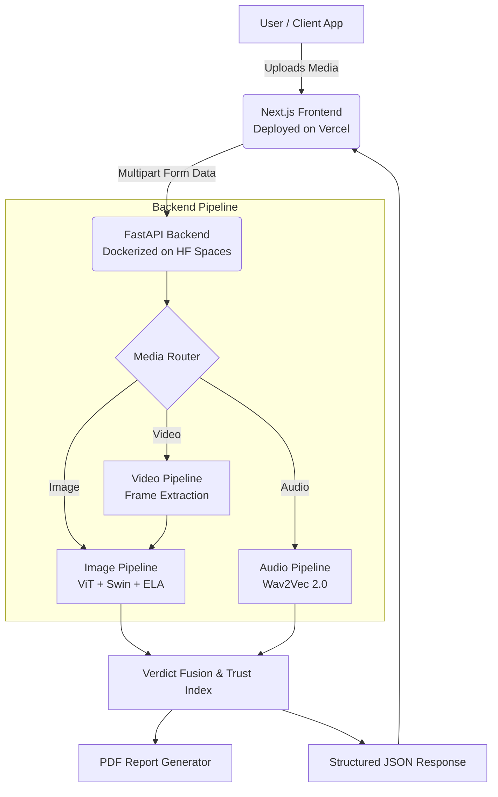

# 🛡️ IntrusionX SE (Tattva.AI)

<div align="center">
  <h3>Next-Generation Multi-Modal Deepfake & Synthetic Media Detection Platform</h3>
  <p><em>Built as a production-grade enterprise security layer to detect, analyze, and quarantine synthetic media.</em></p>

  [](#)
  [](#)
  [](#)
  [](#)
  [](#)
</div>

---

## 🎯 Executive Summary
As synthetic media and generative AI rapidly evolve, traditional verification methods are failing. **IntrusionX SE** is a zero-trust, multi-modal detection engine that analyzes **Video, Audio, and Images** to mathematically prove content authenticity. 

Designed for **HackHalt**, this system isn't just a basic prototype—it's a hardened, hardware-accelerated pipeline featuring ensemble vision models, scene-change aware video analysis, and comprehensive PDF forensic reporting.

## ✨ Core Technical Capabilities

### 📷 Dual-Ensemble Image Forensics
- **Vision Transformer (ViT)**: Evaluates structural anomalies using `dima806/deepfake_vs_real`.
- **Swin Transformer**: Catches synthetic generation markers specific to Stable Diffusion & Midjourney using `umm-maybe/AI-image-detector`.
- **Error Level Analysis (ELA)**: Computes byte-level discrepancies to identify manipulated ("photoshopped") regions.
- **Auto Face-Cropping**: OpenCV Haar Cascades automatically isolate facial features to run localized anomaly detection.

### 🎬 Temporal Video Analysis
- **Smart Frame Sampling**: Rejects uniform sampling in favor of scene-change detection to ensure the AI analyzes diverse structural content rather than duplicated frames.
- **Max-Mean Aggregation**: Prevents single-frame glitches from ruining the verdict while ensuring consistent deepfakes are caught.

### 🎙️ Audio Deepfake Detection
- **Wav2Vec 2.0**: Employs fine-tuned transformer architectures (`Melina/deepfake_audio_detection`) to detect synthetic intonation patterns.
- **Spectrographic Visualization**: Generates Mel-Spectrograms mapped against standard human frequency bounds.

---

## 🏗️ System Architecture

IntrusionX SE runs on a decoupled architecture, isolating the heavy AI inference away from the presentation layer.



---

## 🚀 Local Installation

The project is split into two independent repositories for microservice compliance.

### 1. Start the API Backend (`/intrusionx-se`)
```bash
cd intrusionx-se

# Create a virtual environment
python3 -m venv venv
source venv/bin/activate  # On Windows use: venv\Scripts\activate

# Install dependencies
pip install -r requirements.txt

# Run the FastAPI server
uvicorn api:app --reload --port 8000
```

### 2. Start the Frontend (`/intrusionx-frontend`)
```bash
cd intrusionx-frontend

# Install dependencies
npm install

# Set the backend URL in a .env file (Points to local backend)
echo "NEXT_PUBLIC_API_URL=http://localhost:8000" > .env

# Run the development server
npm run dev
```

---

## ☁️ Deployment Specifications

IntrusionX SE is fully configured for cloud deployment:
- **Backend**: Containerized via `Dockerfile` using `python:3.9-slim`. It automatically installs OpenGL system proxies (`libgl1`, `libglib2.0-0`) required for headless OpenCV processing. Hosted on **Hugging Face Spaces**.
- **Frontend**: Edge-optimized **Next.js** build specifically routed to allow large 100MB+ media uploads, hosted on **Vercel**.
- **CORS Hardening**: Strict origin rules enforced on the backend to prevent cross-site request forgery outside of the verified Vercel subnet.

## 📈 Roadmap & Future Enhancements
- **Redis Caching Layer**: To store inference hashes and prevent redundant AI processing of identical files.
- **Expanded Batch Processing**: Asynchronous worker queues (Celery/RabbitMQ) for enterprise scale.
- **Live Camera Feed**: Real-time websocket streaming for instant stream detection.

---

<div align="center">
  <p>Engineered with precision for <b>HackHalt</b>.</p>
</div>
