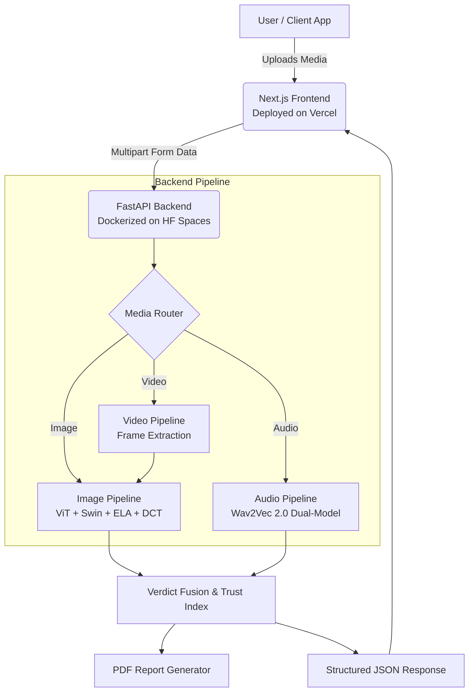

# 🛡️ IntrusionX SE (Tattva.AI)

<div align="center">
  <h3>Next-Generation Multi-Modal Deepfake & Synthetic Media Detection Platform</h3>
  <p><em>Built as a production-grade enterprise security layer to detect, analyze, and quarantine synthetic media.</em></p>

  [](#)
  [](#)
  [](#)
  [](#)
  [](#)
  [](#)
</div>

---

## 🎯 Executive Summary
As synthetic media and generative AI rapidly evolve, traditional verification methods are failing. **IntrusionX SE** is a zero-trust, multi-modal detection engine that analyzes **Video, Audio, and Images** to mathematically prove content authenticity. 

Designed for **HackHalt**, this system isn't just a basic prototype—it's a hardened, hardware-accelerated pipeline featuring ensemble vision models, scene-change aware video analysis, and comprehensive PDF forensic reporting.

## ✨ Core Technical Capabilities

### 📷 Dual-Ensemble Image Forensics
- **Vision Transformer (ViT)**: Fine-tuned deepfake face detector using `prithivMLmods/Deep-Fake-Detector-v2-Model` (92% precision).
- **Swin Transformer**: Catches AI-generated image markers using `umm-maybe/AI-image-detector`.
- **Error Level Analysis (ELA)**: Computes byte-level discrepancies to identify manipulated regions (conservative calibration — max ±2 point influence).
- **DCT Frequency Analysis**: Detects GAN checkerboard artifacts in the frequency domain (corroboration-gated — only activates when models agree).
- **Auto Face-Cropping**: OpenCV Haar Cascades automatically isolate facial features for localized anomaly detection.

### 🎬 Temporal Video Analysis
- **Smart Frame Sampling**: Scene-change detection ensures the AI analyzes diverse structural content rather than duplicated frames.
- **Max-Mean Aggregation**: Prevents single-frame glitches from ruining the verdict while ensuring consistent deepfakes are caught.

### 🎙️ Audio Deepfake Detection
- **Wav2Vec 2.0 (Model A)**: `garystafford/wav2vec2-deepfake-voice-detector` — detects TTS from ElevenLabs, Amazon Polly, Kokoro, etc.
- **Wav2Vec 2.0 (Model B)**: `MelodyMachine/Deepfake-audio-detection-V2` — complementary detection for broader coverage.
- **Spectrographic Visualization**: Generates Mel-Spectrograms mapped against standard human frequency bounds.

---

## 🏗️ System Architecture

IntrusionX SE runs on a decoupled architecture, isolating the heavy AI inference away from the presentation layer.



---

## 🚀 Local Installation

### Option A: Docker Compose (Recommended)

The fastest way to run the full stack — no Python env, no Node env, one command:

```bash
git clone https://github.com/ayush-writes-code/Tattva.ai.git
cd Tattva.ai

# Make sure intrusionx-backend is cloned alongside this repo:
# Downloads/
# ├── Tattva.ai/            (this repo)
# └── intrusionx-backend/   (the Python API)

docker compose up --build
```

| Service  | URL                    |
|----------|------------------------|
| Frontend | http://localhost:3000   |
| Backend  | http://localhost:8000   |

> **Note**: First build takes 5-10 minutes (downloads AI models). Subsequent runs use Docker cache.

### Option B: Manual Setup

#### 1. Start the API Backend
```bash
cd intrusionx-backend

# Create a virtual environment
python3 -m venv venv
source venv/bin/activate  # On Windows use: venv\Scripts\activate

# Install dependencies
pip install -r requirements.txt

# Run the FastAPI server
uvicorn api:app --reload --port 8000
```

#### 2. Start the Frontend
```bash
cd Tattva.ai

# Install dependencies
npm install

# Create environment file
echo "NEXT_PUBLIC_API_URL=http://localhost:8000" > .env.local

# Run the development server
npm run dev
```

---

## 🤖 AI Models Used

| Model | Type | Architecture | What It Detects |
|-------|------|-------------|-----------------|
| `prithivMLmods/Deep-Fake-Detector-v2-Model` | Image | ViT (Vision Transformer) | Face-swapped deepfakes, GAN-generated faces |
| `umm-maybe/AI-image-detector` | Image | Swin Transformer | AI-generated art (Stable Diffusion, Midjourney, DALL-E) |
| `garystafford/wav2vec2-deepfake-voice-detector` | Audio | Wav2Vec2-XLSR | TTS voices (ElevenLabs, Polly, Kokoro, Hume) |
| `MelodyMachine/Deepfake-audio-detection-V2` | Audio | Wav2Vec2 | Complementary synthetic voice detection |

### Ensemble Strategy
- **Face detected**: ViT model weighted 70%, Swin 30% (ViT excels at face analysis)
- **No face**: Swin model weighted 90%, ViT 10% (Swin excels at general AI art)
- **Forensic layers** (ELA + DCT): Max ±5 points, only when models already lean toward fake (corroboration-gated)

---

## ☁️ Deployment Specifications

- **Backend**: Containerized via `Dockerfile` using `python:3.11-slim`. Hosted on **Hugging Face Spaces** with API key protection.
- **Frontend**: Edge-optimized **Next.js** build on **Vercel**. Supports 100MB+ media uploads.
- **Docker Compose**: Full-stack containerization for local development with proper service networking.
- **CORS Hardening**: Strict origin rules enforced on the backend.

## 📈 Roadmap & Future Enhancements
- **Redis Caching Layer**: To store inference hashes and prevent redundant AI processing of identical files.
- **Expanded Batch Processing**: Asynchronous worker queues (Celery/RabbitMQ) for enterprise scale.
- **Live Camera Feed**: Real-time websocket streaming for instant stream detection.

---

<div align="center">
  <p>Engineered with precision for <b>HackHalt</b>.</p>
</div>
